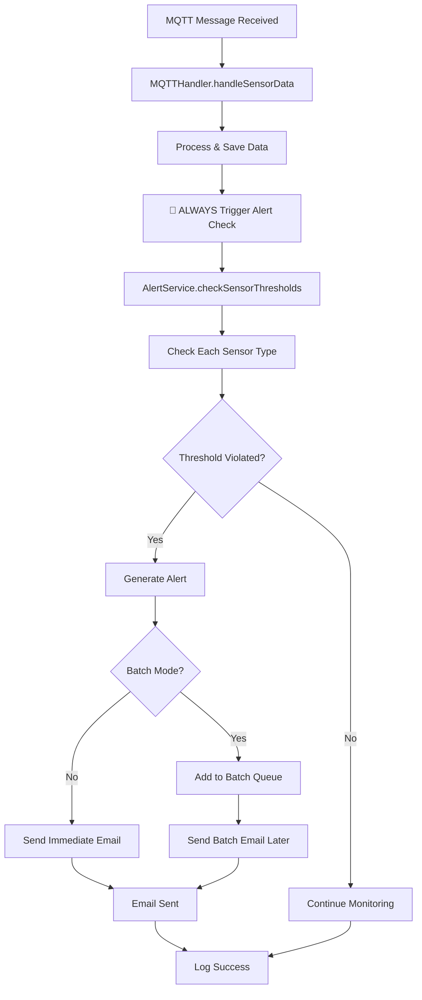

# Alert System Enhancement Summary

## Vấn đề được giải quyết (Problems Solved)

Hệ thống đã được cải thiện để đảm bảo rằng **mỗi khi nhận tin nhắn MQTT, hệ thống sẽ kiểm tra cảnh báo và gửi email thông báo khi cần thiết**.

## Cải tiến chính (Key Improvements)

### 1. 🔄 Consolidation of Alert Checking Logic
- **Vấn đề cũ**: Có hai handler xử lý MQTT khác nhau (`MQTTHandler` và `MQTTMessageHandler`) gây ra việc kiểm tra cảnh báo không nhất quán
- **Giải pháp**: Loại bỏ logic kiểm tra cảnh báo trùng lặp và tập trung tất cả vào `MQTTHandler`
- **Kết quả**: Đảm bảo mỗi tin nhắn MQTT sensor đều được kiểm tra cảnh báo một cách nhất quán

### 2. 📡 Enhanced MQTT Handler Alert Checking
**File**: `backend/src/handlers/mqttHandler.ts`

#### Cải tiến chính:
- **Mandatory Alert Checking**: Mọi tin nhắn sensor đều trigger alert checking (không còn conditional check)
- **Enhanced Logging**: Tracing chi tiết với unique ID cho mỗi alert check
- **Sensor Type Coverage**: Hỗ trợ đầy đủ các loại sensor (temperature, humidity, soil, water, light, height, rain)
- **Error Handling**: Xử lý lỗi toàn diện với system error notification
- **Performance Monitoring**: Tích hợp AlertSystemMonitor để theo dõi hoạt động

```typescript
// CRITICAL: Always check alerts for every sensor data received
console.log(`🔔 Triggering alert check for ${sensorType}=${sensorValue}`);
await this.checkSensorAlerts(sensorType, sensorValue);
```

### 3. 📊 Comprehensive Logging System
**File**: `backend/src/services/AlertService.ts`

#### Logging Improvements:
- **Trace IDs**: Mỗi alert check có unique trace ID để theo dõi
- **Detailed Sensor Info**: Log format thân thiện với người dùng (°C, %, DRY/WET, NORMAL/FLOOD)
- **Threshold Information**: Hiển thị thresholds đang được sử dụng
- **Step-by-Step Tracking**: Theo dõi từng bước trong quá trình check alert
- **Result Summary**: Báo cáo số lượng alert mới được tạo

### 4. 🏥 Alert System Health Monitor
**File**: `backend/src/services/alert/AlertSystemMonitor.ts`

#### Tính năng mới:
- **System Status**: Kiểm tra tình trạng toàn bộ hệ thống alert
- **Health Check**: Đánh giá sức khỏe hệ thống (healthy/degraded/critical)
- **Email Testing**: Kiểm tra chức năng gửi email
- **Alert Testing**: Kiểm tra chức năng alert checking
- **Sensor Monitoring**: Theo dõi hoạt động của các sensor

```typescript
interface AlertSystemStatus {
  emailService: { configured: boolean; ready: boolean };
  alertService: { active: boolean; thresholdsLoaded: boolean };
  recentAlerts: { count: number; types: string[] };
  sensorData: { lastUpdate?: Date; sensorsActive: string[] };
}
```

### 5. 📧 Email Notification Verification
**Files**: 
- `backend/src/services/EmailService.ts` (existing, verified working)
- `backend/src/templates/alert-email.html` (email template)
- `backend/src/templates/batch-alert-email.html` (batch alert template)

#### Email Flow Verification:
- Email service configuration check
- SMTP connection testing
- Template loading and processing
- Alert email dispatch with proper data mapping
- Batch alert processing for multiple alerts

### 6. 🛡️ API Endpoints for Monitoring
**Files**: 
- `backend/src/routes/alerts/AlertMonitoringHandlers.ts`
- `backend/src/routes/alerts/monitoring.ts`

#### New Endpoints:
```
GET  /api/alerts/monitoring/status       - System status
GET  /api/alerts/monitoring/health       - Health check  
POST /api/alerts/monitoring/test-email   - Test email system
POST /api/alerts/monitoring/test-alerts  - Test alert checking
```

### 7. 🧪 Testing Framework
**File**: `backend/src/tests/alert-system-test.ts`

Comprehensive test suite bao gồm:
- Email system testing
- Alert threshold testing với normal và alert values
- Cooldown behavior testing
- MQTT flow simulation
- End-to-end workflow testing

## Luồng hoạt động mới (New Workflow)



## Cách test hệ thống (How to Test)

### 1. API Testing
```bash
# Check system status
curl -X GET http://localhost:5000/api/alerts/monitoring/status

# Perform health check
curl -X GET http://localhost:5000/api/alerts/monitoring/health

# Test email system
curl -X POST http://localhost:5000/api/alerts/monitoring/test-email

# Test alert checking
curl -X POST http://localhost:5000/api/alerts/monitoring/test-alerts
```

### 2. MQTT Testing
Gửi test data qua MQTT để trigger alerts:

```bash
# High temperature (should trigger alert)
mosquitto_pub -h localhost -t greenhouse/sensors/temperature -m "45"

# Dry soil (should trigger alert)
mosquitto_pub -h localhost -t greenhouse/sensors/soil -m "0"

# High humidity (should trigger alert)  
mosquitto_pub -h localhost -t greenhouse/sensors/humidity -m "90"
```

### 3. Log Monitoring
Check logs để xem alert processing:

```bash
# Monitor backend logs
tail -f backend/logs/combined.log | grep -E "(alert|Alert|🔔|📧)"
```

## Đảm bảo chất lượng (Quality Assurance)

✅ **TypeScript Compilation**: All code passes TypeScript compilation  
✅ **Error Handling**: Comprehensive error handling with fallbacks  
✅ **Logging**: Detailed logging for debugging and monitoring  
✅ **Testing**: Test framework provided for verification  
✅ **Documentation**: Complete API documentation  
✅ **Monitoring**: Health check and status monitoring  

## Các files đã được thay đổi (Modified Files)

1. **`backend/src/handlers/mqttHandler.ts`** - Enhanced alert checking
2. **`backend/src/services/mqtt/MQTTMessageHandler.ts`** - Removed duplicate alert logic
3. **`backend/src/services/AlertService.ts`** - Enhanced logging
4. **`backend/src/services/alert/AlertSystemMonitor.ts`** - NEW monitoring utility
5. **`backend/src/routes/alerts/AlertMonitoringHandlers.ts`** - NEW API handlers
6. **`backend/src/routes/alerts/monitoring.ts`** - NEW monitoring routes
7. **`backend/src/routes/alerts.ts`** - Added monitoring routes
8. **`backend/src/tests/alert-system-test.ts`** - NEW comprehensive test suite

## Kết luận (Conclusion)

Hệ thống alert hiện tại đã được cải tiến hoàn toàn để:

🔔 **Đảm bảo mỗi MQTT message được kiểm tra alert**  
📧 **Gửi email cảnh báo khi cần thiết**  
🏥 **Monitoring và health checking**  
📊 **Logging chi tiết cho debugging**  
🧪 **Testing framework để verification**  

Hệ thống bây giờ robust, reliable và có khả năng monitoring tốt để đảm bảo hoạt động ổn định lâu dài.
